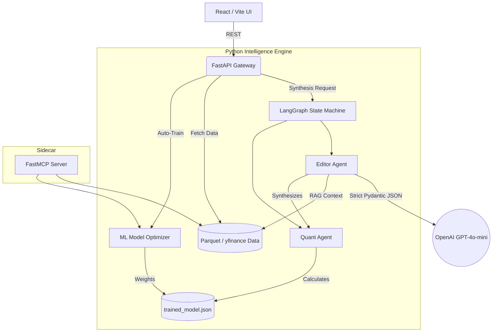

# Stonk: Autonomous ML Trading & Agentic AI Analysis

Stonk is a comprehensive, full-stack AI Engineering and Quantitative Finance platform. It fuses traditional machine learning (XGBoost, SVM, Logistic Regression) with modern Agentic LLM orchestration (LangGraph, OpenAI Structured Outputs) to generate highly reliable, data-backed financial theses.

## 🧠 System Architecture

This project is built on a **Monolithic Service + Sidecar AI Architecture**, bridging the gap between raw data processing and generative AI synthesis.



### 1. Traditional ML Engine (Deterministic)
Before any LLM touches the data, a deterministic ML pipeline calculates technical indicators (MACD, RSI, volatility metrics) and autonomous weights using Logistic Regression or XGBoost. It returns a strict probability of upward/downward movement based purely on historical math.

### 2. Multi-Agent Orchestration (LangGraph)
**Why LangGraph over direct API calls?**
Passing an entire dataset to an LLM in a single zero-shot prompt leads to hallucinations and "lazy" processing. Instead, Stonk utilizes a **LangGraph State Machine**:
*   **The Quant Node (Python):** Calculates the deterministic probabilities and formats the technicals.
*   **The Editor Node (GPT-4o-mini):** Receives the structured quant output alongside recent real-world news, synthesizing them into a coherent `InvestmentThesis` using **Pydantic** to enforce strict JSON schemas.

### 3. Automated Evaluations (LLM-as-a-Judge)
To prevent model drift and ensure reliability, the `evals/` directory contains an automated testing pipeline. A smarter model (`gpt-4o`) grades the output of the Editor Agent against historical test cases, mathematically scoring the agent on Factual Consistency, Conviction Logic, and Hallucination Rates.

### 4. Model Context Protocol (MCP)
The application exposes its intelligence engine via `scripts/mcp_server.py`. This allows external orchestrators (like Claude Desktop) to connect directly to the local ML model and data pipelines via standard `stdio` transport.

---

## 🚀 Getting Started

The easiest way to run Stonk locally is using **Docker**.

### Prerequisites
*   [Docker Desktop](https://www.docker.com/products/docker-desktop/)

### One-Click Boot
```bash
# Clone the repository
git clone https://github.com/yourusername/stonk.git
cd stonk

# Boot the entire stack (FastAPI Backend + React Frontend)
docker-compose up --build
```
*   **Frontend UI:** `http://localhost:5173`
*   **Backend API:** `http://localhost:8000`

### 🔑 OpenAI Integration
The traditional ML models run 100% locally and completely free. 
To enable the **AI Analyst Synthesis**, set the `OPENAI_API_KEY` environment variable in your `.env` file or `docker-compose.yml`. The system automatically detects the key and enables the LangGraph orchestration.


---

## 📊 Roadmap: The AI Mastery Pipeline

This project lays the groundwork for complete AI autonomy. The next phase of development focuses on the **Data Flywheel**:
1.  **Synthetic Data Generation:** Run the Evals suite on thousands of historical stock events, saving only the perfect 5/5 theses to a dataset.
2.  **Local Fine-Tuning:** Use LoRA to fine-tune an open-source model (e.g., Llama-3-8B) on the high-quality synthetic data.
3.  **Complete Autonomy:** Swap out OpenAI for the local, fine-tuned model served via vLLM, resulting in a completely free, highly specialized financial agent.