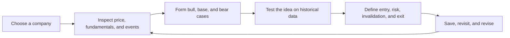
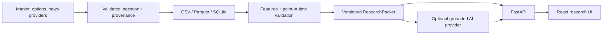

# Stonk

**Learn how to judge a stock, not just how to look up its price.**

Stonk is an evidence-first stock research lab that teaches a repeatable way to investigate a company. Enter a ticker and work through its price history, current events, technical and fundamental context, historical validation, trade planning, and options risk in one research flow.

Most investing apps are optimized to make a chart or a buy/sell label feel decisive. Stonk is designed to make the reasoning inspectable. It shows where a conclusion came from, how fresh the evidence is, what would invalidate the thesis, and how the same idea performed on data that was not used to create it.

No OpenAI key is required. The complete quantitative workflow runs locally; AI is an optional coach that explains existing evidence rather than generating prices or replacing the user's judgment.

> Stonk is educational research software. It does not place trades, manage money, or provide personalized investment advice. Options can lose 100% of their premium.

## The learning loop



Stonk helps a learner answer seven questions:

| Step | Question | What Stonk surfaces |
| --- | --- | --- |
| Understand | What has the stock actually done? | Historical and latest prices, returns, volume, volatility, and trend context |
| Explain | What may be driving it? | Timestamped news, company context, and clearly labeled data sources |
| Argue | What is the case for and against it? | Rules-based bull, base, and bear cases with explicit uncertainty |
| Validate | Would this signal have survived outside its training window? | Chronological and purged walk-forward backtests, benchmarks, drawdown, and calibration |
| Plan | What would make this idea actionable or wrong? | Entry zones, targets, invalidation levels, exit conditions, and position-risk context |
| Compare | Is an option liquid enough to study responsibly? | Chain ranking, spread, volume, open-interest availability, expiration, and loss warnings |
| Reflect | Has the evidence changed? | Persistent ordered bookmarks and repeatable research packets |

The goal is not to make the user certain. It is to help the user become more disciplined about evidence, uncertainty, and risk.

## Why the output is auditable

The product is intentionally split into two layers:

- The **deterministic research layer** calculates prices, indicators, model scores, backtests, entry and invalidation levels, and options-liquidity metrics.
- The **optional explanation layer** turns a versioned research packet into a bull case, bear case, uncertainties, and cited follow-up questions. It cannot overwrite calculated values or invent market data.

Every research result is built around a `ResearchPacket`: a versioned collection of quantitative results and timestamped evidence with stable IDs. This makes a conclusion traceable and gives an AI coach a constrained set of facts to explain.

## What works today

- Familiar multi-range historical and latest price exploration
- Technical, volatility, volume, and fundamental summaries
- Chronological and purged walk-forward validation
- Rules-based bull, base, and bear thesis
- Entry, invalidation, target, and exit scenarios
- Options-chain ranking when a configured provider returns a chain
- Current-event headlines with provider, URL, and publication time
- Offline-first ordered bookmarks backed by the local database
- Optional local or hosted AI explanations grounded in research-packet evidence

All of the core research features work with AI disabled.

## Architecture



See [ARCHITECTURE.md](ARCHITECTURE.md) for boundaries, failure modes, and design decisions.

## Optional AI coach

AI is deliberately not the source of truth. It receives the same versioned evidence shown in the interface and can help a learner:

- Translate unfamiliar metrics into plain language
- Contrast the bull and bear cases
- Identify unsupported assumptions
- Ask what evidence would change the thesis
- Explain risk and uncertainty without fabricating a forecast

Set `STONK_LLM_PROVIDER=local` to use an OpenAI-compatible local server such as Ollama or LM Studio, or `STONK_LLM_PROVIDER=openai` with a server-side API key. `disabled` is the safe default.

## Local development

Requirements:

- Python 3.12+
- Node 22.12+

```bash
git clone https://github.com/cheny512/stonk.git
cd stonk
cp .env.example .env
python3 -m venv .venv
.venv/bin/pip install -r requirements.txt
cd ui && npm ci && npm run dev
```

Open the UI at [http://127.0.0.1:5173](http://127.0.0.1:5173). The API runs at [http://127.0.0.1:8000](http://127.0.0.1:8000); a 404 at the API root is expected. Health is available at `/api/health`.

### Saved-stock persistence

Bookmarks are offline-first: the UI writes immediately to browser storage, then backs the ordered list up to the configured SQL database through a token-protected anonymous device profile. No login or external auth credential is required. Failed syncs remain local and retry during a later API session.

SQLite is the local default at `data/stonk.db`. Missing tables are provisioned automatically for local development. Managed deployments should set `DATABASE_URL` to their database and apply versioned migrations before starting the API:

```bash
.venv/bin/alembic upgrade head
```

The `users` schema intentionally supports upgrading an anonymous profile to a verified account later. Until login is added, clearing browser site data also removes the device-profile token needed to retrieve that profile from the database.

### ThetaData v3 options

ThetaData is the default options provider, so Massive options access is not required. The adapter talks to the local [Theta Terminal v3](https://docs.thetadata.us/Articles/Getting-Started/Getting-Started.html) REST server; it never sends ThetaData credentials from the web API.

1. Generate a ThetaData API key and set `THETADATA_API_KEY`, or retain the legacy ThetaData username/password values already supported by the launcher.
2. Install Java 21+, download `ThetaTerminalv3.jar`, then run `.venv/bin/python scripts/start_thetadata.py` in a separate terminal.
3. Keep `THETADATA_BASE_URL=http://127.0.0.1:25503/v3` and `STONK_OPTIONS_PROVIDER=thetadata` in this project's `.env`.
4. Leave Theta Terminal running alongside `npm run dev`.

The launcher passes `THETADATA_API_KEY` through the terminal environment. For the email/password flow, it creates a permission-restricted temporary `creds.txt`, points Theta Terminal at it, and removes it when the terminal exits. Stonk's web API never transmits those credentials.

On ThetaData's free tier, Stonk automatically falls back from paid live snapshots to the most recent completed EOD option chain. The UI reports that chain's actual date. Spread and volume safeguards remain active; open interest is enforced only when the subscribed endpoint supplies it.

`THETADATA_USE_SNAPSHOTS=false` is the default and avoids probing paid endpoints. Set it to `true` only when the ThetaData account includes snapshot access.

Alternatively:

```bash
docker compose up --build
```

## Verification

```bash
.venv/bin/python -m pytest
cd ui && npm run check
```

CI runs backend tests with coverage, frontend type checking, and a production build. The test suite does not require live provider credentials.

## Data and model integrity

- Features use only observations available on or before the scored date.
- Walk-forward folds purge the prediction horizon between training and testing.
- Non-overlapping trades are the default for horizon-return evaluation.
- Results report signal count, calibration error, drawdown, benchmark return, and uncertainty around hit rate.
- News and fundamentals are labeled with source and retrieval timestamps.
- AI responses must cite evidence IDs from the research packet; unsupported citations are rejected.

Known limitations are recorded in [ARCHITECTURE.md](ARCHITECTURE.md). In particular, free delayed providers are useful for research and demos but are not execution-grade feeds.

## API

FastAPI exposes interactive OpenAPI documentation at `http://127.0.0.1:8000/docs`.

Long-running research can be submitted with an `Idempotency-Key` and polled:

```bash
curl -X POST http://127.0.0.1:8000/api/jobs/autopilot/AAPL \
  -H 'Content-Type: application/json' \
  -H 'Idempotency-Key: demo-aapl-1' \
  -d '{"refresh": false, "include_options": false}'

curl http://127.0.0.1:8000/api/jobs/JOB_ID
```

Job state is persisted in SQLite. An interrupted local worker marks unfinished work as interrupted on restart instead of silently reporting success.

## Learning roadmap

The current product is a guided research workbench. The next learning layer will turn that workflow into deliberate practice:

- **Point-in-time missions:** investigate a historical company using only the information that was available on that date
- **Decision journal:** record a thesis, confidence, entry, exit, invalidation condition, and position-risk limit before seeing the outcome
- **Evidence checkpoints:** revise a thesis as earnings, filings, and news are revealed without rewriting the original decision
- **Judgment scoring:** measure calibration, evidence quality, risk discipline, and benchmark-relative results instead of rewarding raw profit alone
- **Learning history:** show recurring strengths, blind spots, and improvement across completed research sessions
- **Cohorts and challenges:** let classrooms and investing clubs study the same scenario while keeping the future hidden

The long-term goal is a market simulator that asks not only whether a trade made money, but whether the decision was reasonable given the evidence available at the time.

## Responsible use

Confidence comes from traceable evidence and explicit uncertainty, not from a confident-sounding model. Never trade solely from this application. Verify data against primary sources and understand liquidity, tax, assignment, and loss risks before using options.
