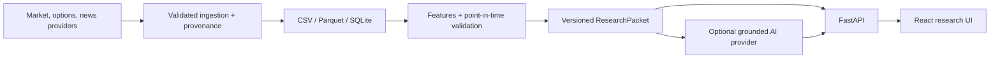

# Stonk

Stonk is a local-first stock research workbench. It combines reproducible market-data analysis, point-in-time backtests, options context, sourced current events, and an optional AI research coach.

The product is intentionally split into two layers:

- The deterministic layer calculates prices, indicators, model scores, backtests, entry/invalidation levels, and options liquidity metrics.
- The explanation layer turns a versioned research packet into a bull case, bear case, uncertainties, and cited follow-up questions. It is optional and is never allowed to invent market data.

Stonk is research software, not a broker, fiduciary, or personalized investment adviser. Options can lose 100% of their premium.

## Architecture



See [ARCHITECTURE.md](ARCHITECTURE.md) for boundaries, failure modes, and design decisions.

## What works without an AI key

- Historical and latest price charts
- Technical, volatility, volume, and fundamental summaries
- Chronological and purged walk-forward validation
- Rules-based bull/base/bear thesis
- Entry, invalidation, target, and exit scenarios
- Options-chain ranking when a configured provider returns a chain
- Current-event headlines with provider, URL, and publication time

AI is an optional research coach. Set `STONK_LLM_PROVIDER=local` to use an OpenAI-compatible local server such as Ollama or LM Studio, or `STONK_LLM_PROVIDER=openai` with a server-side API key. `disabled` is the safe default.

## Local development

Requirements:

- Python 3.12+
- Node 22.12+

```bash
git clone https://github.com/cheny512/stonk.git
cd stonk
cp .env.example .env
python3 -m venv .venv
.venv/bin/pip install -r requirements.txt
cd ui && npm ci && npm run dev
```

Open the UI at [http://127.0.0.1:5173](http://127.0.0.1:5173). The API runs at [http://127.0.0.1:8000](http://127.0.0.1:8000); a 404 at the API root is expected. Health is available at `/api/health`.

### ThetaData v3 options

ThetaData is the default options provider, so Massive options access is not required. The adapter talks to the local [Theta Terminal v3](https://docs.thetadata.us/Articles/Getting-Started/Getting-Started.html) REST server; it never sends ThetaData credentials from the web API.

1. Generate a ThetaData API key and set `THETADATA_API_KEY`, or retain the legacy ThetaData username/password values already supported by the launcher.
2. Install Java 21+, download `ThetaTerminalv3.jar`, then run `.venv/bin/python scripts/start_thetadata.py` in a separate terminal.
3. Keep `THETADATA_BASE_URL=http://127.0.0.1:25503/v3` and `STONK_OPTIONS_PROVIDER=thetadata` in this project's `.env`.
4. Leave Theta Terminal running alongside `npm run dev`.

The launcher passes `THETADATA_API_KEY` through the terminal environment. For the email/password flow, it creates a permission-restricted temporary `creds.txt`, points Theta Terminal at it, and removes it when the terminal exits. Stonk's web API never transmits those credentials.

On ThetaData's free tier, Stonk automatically falls back from paid live snapshots to the most recent completed EOD option chain. The UI reports that chain's actual date. Spread and volume safeguards remain active; open interest is enforced only when the subscribed endpoint supplies it.

Alternatively:

```bash
docker compose up --build
```

## Verification

```bash
.venv/bin/python -m pytest
cd ui && npm run check
```

CI runs backend tests with coverage, frontend type checking, and a production build. The test suite does not require live provider credentials.

## Data and model integrity

- Features use only observations available on or before the scored date.
- Walk-forward folds purge the prediction horizon between training and testing.
- Non-overlapping trades are the default for horizon-return evaluation.
- Results report signal count, calibration error, drawdown, benchmark return, and uncertainty around hit rate.
- News and fundamentals are labeled with source and retrieval timestamps.
- AI responses must cite evidence IDs from the research packet; unsupported citations are rejected.

Known limitations are recorded in [ARCHITECTURE.md](ARCHITECTURE.md). In particular, free delayed providers are useful for research and demos but are not execution-grade feeds.

## API

FastAPI exposes interactive OpenAPI documentation at `http://127.0.0.1:8000/docs`.

Long-running research can be submitted with an `Idempotency-Key` and polled:

```bash
curl -X POST http://127.0.0.1:8000/api/jobs/autopilot/AAPL \
  -H 'Content-Type: application/json' \
  -H 'Idempotency-Key: demo-aapl-1' \
  -d '{"refresh": false, "include_options": false}'

curl http://127.0.0.1:8000/api/jobs/JOB_ID
```

Job state is persisted in SQLite. An interrupted local worker marks unfinished work as interrupted on restart instead of silently reporting success.

## Responsible use

Confidence comes from traceable evidence and explicit uncertainty, not from a confident-sounding model. Never trade solely from this application. Verify data against primary sources and understand liquidity, tax, assignment, and loss risks before using options.
